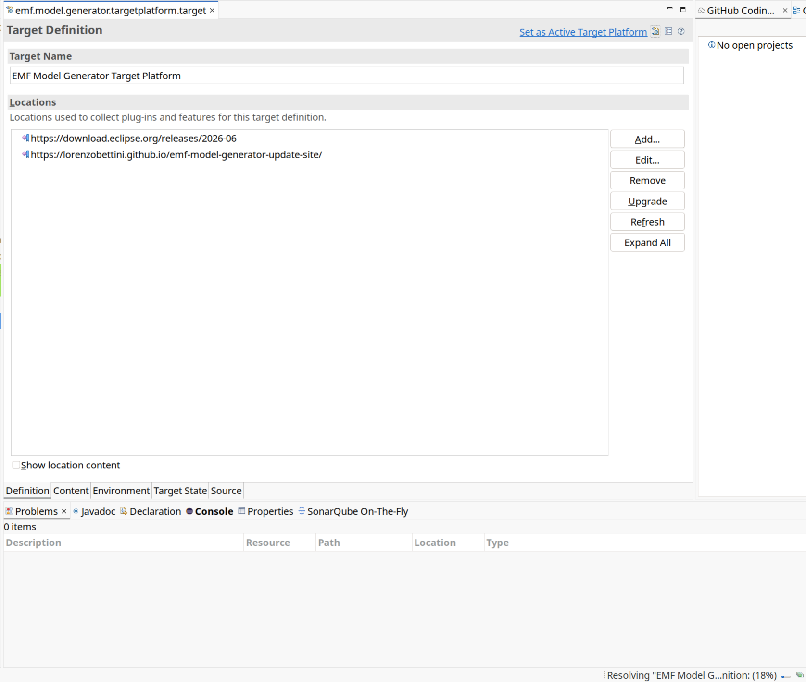
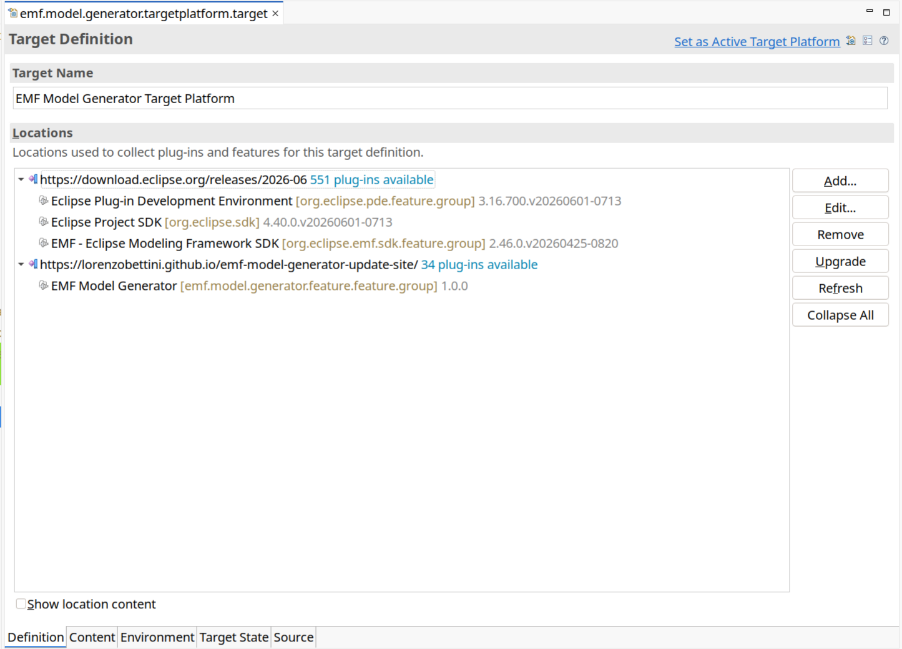
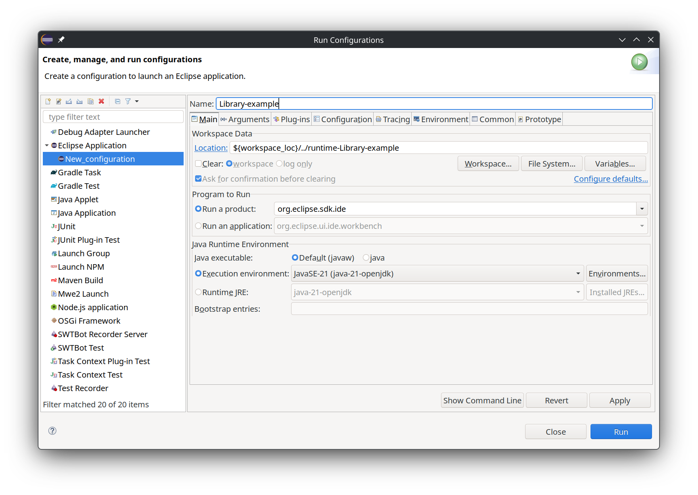
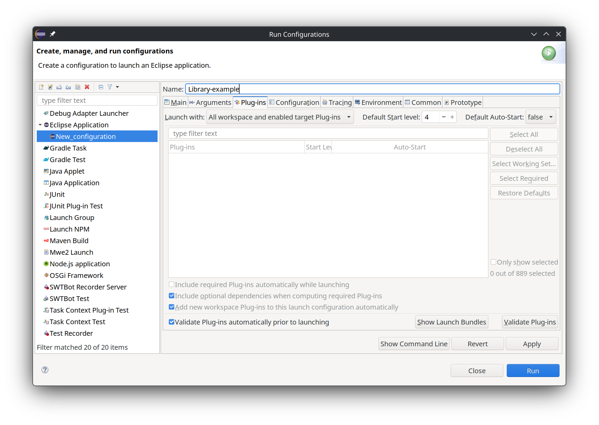
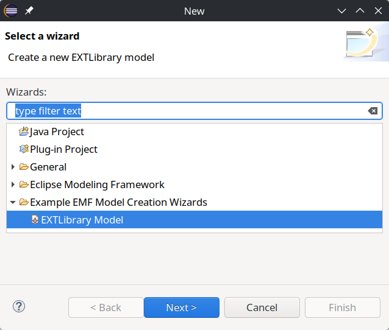
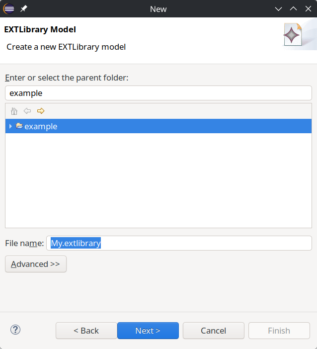
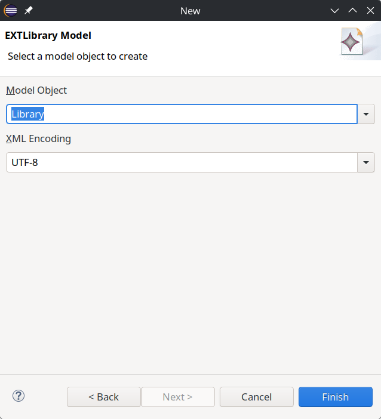
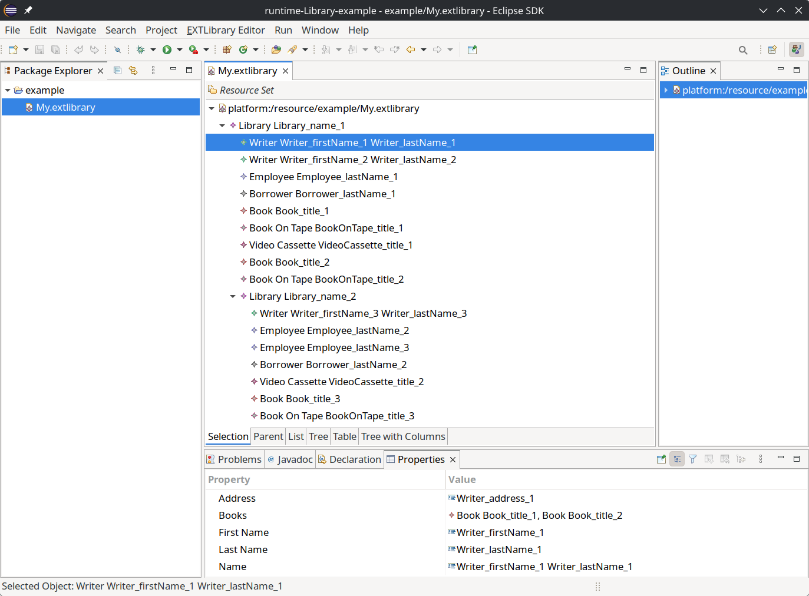

# EMF Model Generator — Extended Library Example

This repository shows how to use
[LorenzoBettini/emf-model-generator](https://github.com/LorenzoBettini/emf-model-generator/)
in an Eclipse Modeling Framework (EMF) editor.

The example is based on EMF's Extended Library model. Its generated **New
EXTLibrary Model** wizard has been customized so that a newly created model is
immediately filled with deterministic sample data. The library populates
attributes, containment references, cross-references, and feature maps while
respecting the structure of the Ecore metamodel.

> `emf-model-generator` generates **instances of an EMF model**. The Java model,
> edit, and editor code in this repository was generated separately by EMF from
> the Ecore and GenModel definitions.

## The integration

The relevant customization is in
[`EXTLibraryModelWizard.java`](org.eclipse.emf.examples.library.editor/src/org/eclipse/emf/examples/extlibrary/presentation/EXTLibraryModelWizard.java).
The standard generated code first creates the root object; an
`EMFInstancePopulator` then populates that object before the wizard saves it:

```java
protected EObject createInitialModel() {
    EObject rootObject = createInitialModelGen();

    EMFInstancePopulator populator = new EMFInstancePopulator();
    populator.setContainmentReferenceMaxCountFor(
        EXTLibraryPackage.Literals.LIBRARY__BRANCHES, 1);
    populator.setContainmentReferenceDefaultMaxCount(5);
    populator.setFeatureMapDefaultMaxCount(4);
    populator.setMaxDepth(2);
    populator.populateEObjects(rootObject);

    return rootObject;
}
```

This configuration:

- creates at most one nested branch for `Library.branches`;
- creates up to five objects for other multi-valued containment references;
- creates up to four entries in a feature map;
- limits recursive containment population to a depth of two.

Requested counts are still constrained by the lower and upper bounds of the
metamodel. Generated values and candidate selection are deterministic, making
the resulting files suitable for examples and repeatable tests.

The editor plug-in declares the OSGi dependency in
[`MANIFEST.MF`](org.eclipse.emf.examples.library.editor/META-INF/MANIFEST.MF):

```text
Require-Bundle: ...,
 emf-model-generator;bundle-version="1.0.0"
```

The dependency is supplied by the included target platform through the
project's [p2 update site](https://lorenzobettini.github.io/emf-model-generator-update-site/).

## Requirements

- Eclipse IDE with Plug-in Development Environment (PDE); we suggest the **Eclipse Modeling Tools** distribution package, which includes EMF and PDE.
- Java 21 or newer
- Internet access the first time the target platform is resolved

The target definition uses the Eclipse 2026-06 release repository and the EMF
Model Generator update site. This repository does not use Maven or Gradle; its
dependencies are managed by the Eclipse target platform.

## Run the example

### 1. Import and resolve the target platform

Clone this repository and start Eclipse with Java 21 or newer. Choose **File →
Import → General → Existing Projects into Workspace** and import all four
projects from the repository root. Expect compilation errors until the target
platform is resolved.

Open
[`emf.model.generator.targetplatform.target`](org.eclipse.emf.examples.library.targetplatform/emf.model.generator.targetplatform.target).
Eclipse first downloads and resolves the Eclipse, EMF, PDE, and EMF Model
Generator dependencies. The status bar shows the resolution progress:



When the installable units appear under **Locations**, click **Set as Active
Target Platform**:



Wait for Eclipse to rebuild the workspace before continuing.

### 2. Launch the example plug-ins

Open `org.eclipse.emf.examples.library.editor/plugin.xml` and choose **Run As →
Run Configurations…**. Create or select an **Eclipse Application** configuration.
On the **Main** tab, use the Eclipse IDE product and a Java 21 JRE. You can also
choose a dedicated runtime workspace here:



On the **Plug-ins** tab, ensure the "All workspace and Enabled Target Plug-ins" option is selected, followed by **Validate Plug-ins**
to ensure that both the example and `emf-model-generator` bundles are available:



Click **Run** to start a second Eclipse instance containing the example editor.

### 3. Create a populated Extended Library model

In the launched Eclipse instance, create a general project if the runtime
workspace does not already contain one. Then choose **File → New → Other…**, open
**Example EMF Model Creation Wizards**, select **EXTLibrary Model**, and click
**Next**:



Select the project as the parent folder, enter a file name with the
`.extlibrary` extension, and click **Next**:



Choose **Library** as the model object and click **Finish**:



The wizard creates the file and opens it in the generated tree editor. Expand
the root to inspect the writers, employees, borrowers, stock, and nested library
branches created by `EMFInstancePopulator`:



## Project layout

| Project | Purpose |
| --- | --- |
| `org.eclipse.emf.examples.library` | Ecore and GenModel files plus the generated model API and implementation |
| `org.eclipse.emf.examples.library.edit` | Generated item providers used to display and edit model objects |
| `org.eclipse.emf.examples.library.editor` | Generated editor and wizard, including the `EMFInstancePopulator` integration |
| `org.eclipse.emf.examples.library.targetplatform` | Eclipse, EMF, PDE, and EMF Model Generator target-platform definition |

The metamodel is defined in
[`extlibrary.ecore`](org.eclipse.emf.examples.library/model/extlibrary.ecore),
and its generator configuration is in
[`extlibrary.genmodel`](org.eclipse.emf.examples.library/model/extlibrary.genmodel).

## Applying the pattern to another generated editor

To use the same approach in your own Eclipse plug-in:

1. Install EMF Model Generator in the development target platform.
2. Add `emf-model-generator` to the editor plug-in's `Require-Bundle` entries.
3. Preserve the wizard's generated root-object creation in a helper method.
4. Override or customize `createInitialModel()` and mark it `@generated NOT`.
5. Configure an `EMFInstancePopulator`, call `populateEObjects(rootObject)`, and
   return the populated root to the wizard's existing save logic.

Keeping the customization in a method marked `@generated NOT` prevents normal
EMF regeneration from replacing it. For complete create/populate/save workflows
outside an existing wizard, use the library's higher-level `EMFModelGenerator`
API instead.

See the
[EMF Model Generator documentation](https://github.com/LorenzoBettini/emf-model-generator/)
for all configuration options, Maven usage, custom value functions, validation,
and resource management.
